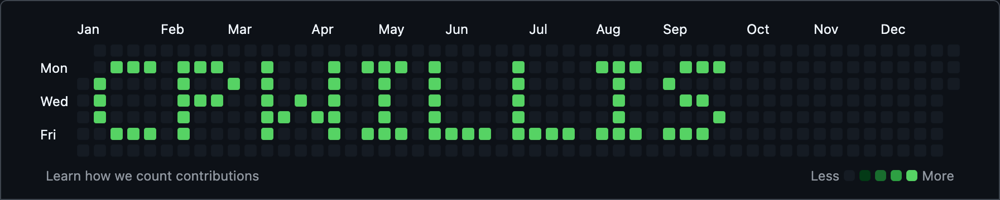

# Yearly Contribution Text

Generate custom text in your GitHub contributions graph for a specific year by creating timestamped commits that form alphanumeric patterns.

This script converts a string (lowercase `a-z` and digits `0-9`) into a 7-row pixel bitmap, then generates empty Git commits on specific dates throughout the year. Each character is rendered using a dot-matrix style pattern, with spacing between characters. The script calculates the first Sunday of the target year and aligns the pixel grid to GitHub's contribution calendar format.

**Maximum character limit: 10 characters** (based on 52-week grid with ~4-column characters plus spacing).

## Features

- Supports lowercase letters (`a-z`) and digits (`0-9`) with custom bitmap patterns.
- Automatically fits text within GitHub's 52-week contribution graph.
- Preview mode displays the pixel pattern in your terminal before committing.
- Creates timestamped empty commits that GitHub recognizes for contribution visualization.

## Usage

### Preview the text

```bash
➜  yearly-contribution-text git:(main) ✗ ./yearly_contribution_text.py cpwillis 2019 --preview

Preview (7 rows × width):

 ███ ███  █   █ ███ █    █    ███  ███
█    █  █ █   █  █  █    █     █  █
█    ███  █ █ █  █  █    █     █   ██
█    █    ██ ██  █  █    █     █     █
 ███ █    █   █ ███ ████ ████ ███ ███

Total width: 39 columns (max: 52)
```

This prints a text-based version of the contribution graph in your terminal.

### Generate commits

```bash
./yearly_contribution_text.py cpwillis 2019
```

This will create empty commits on the correct dates to form the text in your GitHub graph. Make sure you're in a git-initialized repository.

## Notes

- Text longer than the maximum width is truncated to fit.
- Each character is represented as a 7-row pixel pattern.
- Requires Python 3.
- Expands on the concepts covered in [cpwillis/stats](https://github.com/cpwillis/stats) regarding fabricated contributions.

## Example Usage

Preview the GitHub contribution graph generated by this script for the text `cpwillis` on [my profile in 2019](https://github.com/cpwillis?tab=overview&from=2019-12-01&to=2019-12-31).


